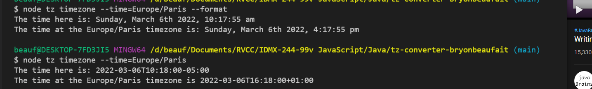

# TimeZone Converter

This app checks the current timezone (America / New York) and compares it to another timezone that is submitted by the user. To do this call Node, then the file, timezone and then a flag for the timezone you wish to call.

## Example

## Flags

- --time='the timezone you wish to check.
- --format (formats the time to read dddd, MMMM Do YYYY, h:mm:ss a)
